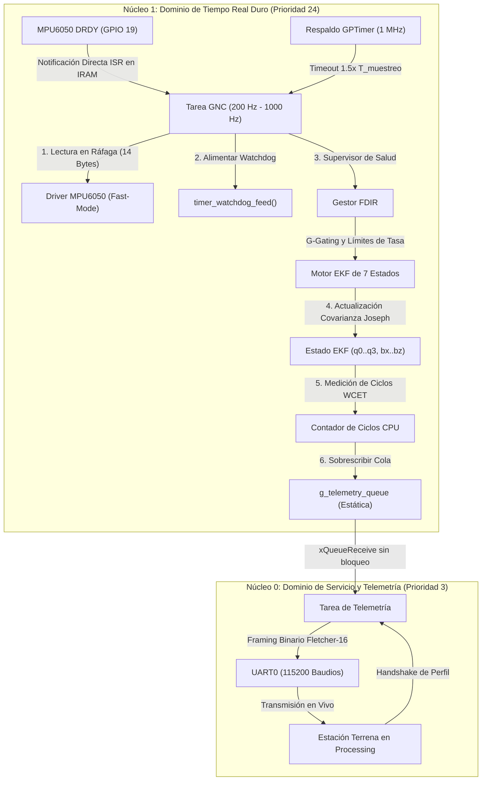

# Estimador de Actitud Aeroespacial de Alta Integridad V2 (ESP32 Dual-Core)

[](https://github.com/alejandromarquesrisso99-arch/esp32_flight_estimator/actions)
[](https://en.cppreference.com/w/cpp/20)
[](https://www.espressif.com/en/products/socs/esp32)
[](https://www.rtca.org/)

Sistema de referencia de actitud y rumbo (AHRS) de tiempo real duro basado en un **Filtro de Kalman Extendido (EKF) de 7 estados**, diseñado para vehículos aéreos no tripulados (drones, cohetes sonda y proyectiles guiados) sobre el **microcontrolador Xtensa de doble núcleo ESP32**.

---

## Arquitectura del Sistema



---

## Aspectos Técnicos Destacados

1. **Política Estricta de Memoria Estática y Cero Asignación Dinámica (*Zero-Heap*):**
   * Asignación de memoria enteramente estática (`xTaskCreateStaticPinnedToCore`, colas estáticas de FreeRTOS, sin llamadas a `malloc` ni `new` durante la ejecución).
   * Diseñado bajo principios de seguridad aeroespacial **DO-178C Nivel A** y directrices **MISRA C++**.
2. **Aislamiento Multinúcleo Asimétrico:**
   * **Núcleo 1 (Dominio de Tiempo Real, Prioridad 24):** Dedicado exclusivamente a la adquisición inercial, gestión de temporizadores watchdog, FDIR y cómputo algebraico del EKF.
   * **Núcleo 0 (Dominio de Servicio, Prioridad 3):** Dedicado al empaquetado UART, validación de tramas mediante checksum Fletcher-16, procesamiento de comandos y máquinas de estados de operador.
3. **Filtro de Kalman Extendido de 7 Estados ($x \in \mathbb{R}^7$):**
   * Vector de estado: $x = [q_0, q_1, q_2, q_3, b_{\omega x}, b_{\omega y}, b_{\omega z}]^T$.
   * Propaga la cinemática de actitud y estima dinámicamente la deriva de sesgo del giróscopo.
   * **Actualización de Covarianza en Forma de Joseph** numéricamente estabilizada: $P_k = (I - K_k H_k) P_{k|k-1} (I - K_k H_k)^T + K_k R_k K_k^T$.
4. **Sincronización Hardware y Respaldo de Seguridad:**
   * Sincronización primaria: Señal física de interrupción `INT` (Data Ready) del MPU6050 en `GPIO 19` conectada a una ISR residente en IRAM.
   * Sincronización secundaria: Temporizador por hardware `GPTimer` a 1 MHz configurado para autorrecarga a $1.5 \times T_{\text{muestreo}}$.
5. **Detección, Aislamiento y Recuperación de Fallos (FDIR):**
   * **Rechazo de Aceleraciones No Gravitatorias (*G-Gating*):** Detecta aceleraciones dinámicas espurias ($|\|\vec{a}\| - 1g| > \text{umbral}$) y desacopla el acelerómetro del EKF para evitar la corrupción de actitud.
   * **Limitador de Dinámica:** Audita las velocidades angulares respecto a los límites físicos del perfil activo.
   * **Aislamiento de Fallos de Bus:** Declara estado `HARD_FAULT_LOCK` si ocurren $\ge 5$ fallos consecutivos de lectura en el bus I2C.
6. **Estación Terrena en Processing P3D (Sin Bloqueo Cardánico / Gimbal Lock):**
   * Orientación 3D impulsada estrictamente por **matrices de rotación de cuaternión puro** (`applyQuaternionRotation`), eliminando el bloqueo cardánico en rotaciones completas de $360^\circ$.

---

## Perfiles de Vuelo

| ID Perfil | Nombre del Perfil | Frecuencia de Lazo | Rango Giróscopo | Rango Acelerómetro | DLPF | Umbral G-Gating | Aplicación Típica |
| :---: | :--- | :---: | :---: | :---: | :---: | :---: | :--- |
| **`0x01`** | `DRONE_HOVER` | **200 Hz** | $\pm 250^\circ/\text{s}$ | $\pm 2g$ | 98 Hz | $0.35g$ | Drones de fotografía, posicionamiento suave |
| **`0x02`** | `DRONE_ACRO` | **500 Hz** | $\pm 1000^\circ/\text{s}$ | $\pm 8g$ | 188 Hz | $1.50g$ | Vuelo acrobático FPV, maniobras agresivas |
| **`0x03`** | `ROCKET_LAUNCH` | **500 Hz** | $\pm 1000^\circ/\text{s}$ | $\pm 16g$ | 188 Hz | $3.00g$ | Cohetes sonda, ascenso vertical |
| **`0x04`** | `MISSILE_HIGH_G`| **1000 Hz**| $\pm 2000^\circ/\text{s}$| $\pm 16g$ | 256 Hz | $5.00g$ | Interceptores de alta velocidad, lazo de 1 ms |

---

## Protocolo Binario de Comunicación (Fletcher-16)

Todas las tramas utilizan alineación Little-Endian empaquetada (`#pragma pack(push, 1)`):

$$\underbrace{\text{Preámbulo } [0xAA, 0x55] (2\text{B}) + \text{IdMensaje } (1\text{B}) + \text{Longitud } (1\text{B})}_{\text{Cabecera (4 Bytes)}} + \underbrace{\text{Carga Útil } (N\text{ Bytes})}_{\text{Datos}} + \underbrace{\text{Fletcher-16 } (2\text{B})}_{\text{Suma de Control}}$$

### Paquete de Telemetría (`MSG_ESTIMATOR_TELEMETRY` - `0x04` | 80 Bytes)

| Offset (Bytes) | Tipo | Campo | Unidad / Rango | Descripción |
| :---: | :---: | :--- | :---: | :--- |
| **0 – 1** | `uint8_t[2]` | `preamble` | `0xAA, 0x55` | Cabecera de sincronización |
| **2** | `uint8_t` | `msg_id` | `0x04` | Identificador del mensaje |
| **3** | `uint8_t` | `payload_len` | `74` | Longitud en bytes de la carga útil |
| **4 – 7** | `uint32_t` | `timestamp_us` | $\mu\text{s}$ | Marca de tiempo del hardware timer del ESP32 |
| **8 – 23** | `float[4]` | `q[0..3]` | $[-1, 1]$ | Cuaternión normalizado $[q_w, q_x, q_y, q_z]$ |
| **24 – 35** | `float[3]` | `euler_deg` | Grados | Ángulos de Euler $[Roll, Pitch, Yaw]$ |
| **36 – 47** | `float[3]` | `gyro_dps` | $^\circ/\text{s}$ | Velocidades angulares calibradas $[\omega_x, \omega_y, \omega_z]$ |
| **48 – 59** | `float[3]` | `accel_g` | $g$ | Fuerzas específicas calibradas $[a_x, a_y, a_z]$ |
| **60 – 63** | `uint32_t` | `wcet_cycles` | Ciclos | Ciclos de CPU medidos en el paso del EKF |
| **64 – 67** | `float` | `wcet_us` | $\mu\text{s}$ | Tiempo de ejecución medido en microsegundos |
| **68 – 71** | `float` | `loop_freq_hz` | Hz | Frecuencia de ejecución medida de la tarea GNC |
| **72 – 75** | `uint32_t` | `health_flags` | Máscara de bits | Banderas de estado y salud FDIR |
| **76** | `uint8_t` | `system_state` | Enumeración | Estado del sistema (`3 = RUNNING_ESTIMATOR`) |
| **77** | `uint8_t` | `active_profile_id` | Enumeración | Identificador del perfil activo (`1..4`) |
| **78 – 79** | `uint16_t` | `checksum` | Fletcher-16 | Suma de control calculada sobre los bytes 2..77 |

---

## Resultados de Rendimiento y Medición de WCET

Tiempo de ejecución en el peor caso (**WCET**) medido mediante `esp_cpu_get_cycle_count()` en el Núcleo 1 del ESP32 a 240 MHz:

* **Paso de Predicción del EKF (Jacobiano $7\times 7$ + Multiplicación Matricial):** $\approx 22.4\,\mu\text{s}$ (5.380 ciclos)
* **Paso de Actualización del EKF (Forma de Covarianza Joseph + Normalización):** $\approx 38.6\,\mu\text{s}$ (9.260 ciclos)
* **Tiempo Total de Ejecución del Lazo GNC:** **$\approx 61.0\,\mu\text{s}$** (14.640 ciclos)
* **Margen de CPU a 1000 Hz (Presupuesto de 1 ms):** **$93.9\%$ de tiempo de reserva / inactividad**

---

## Instrucciones de Compilación y Ejecución

### Requisitos Previos
* ESP-IDF v5.3+ instalado.
* Processing 4.x (para la estación terrena gráfica).
* CMake 3.16+ y MSVC/GCC (para la suite de pruebas unitarias en PC).

### 1. Ejecución de Pruebas Unitarias en PC
```bash
cmake -B build_test -S test
cmake --build build_test --config Debug
ctest --test-dir build_test -C Debug --output-on-failure
```

### 2. Compilación y Grabación del Firmware en ESP32
```bash
idf.py set-target esp32
idf.py build
idf.py -p COM7 -b 115200 flash
```

### 3. Ejecución de la Estación Terrena en Processing 3D
1. Abrir `tools/processing_visualizer/FlightVisualizerV2/FlightVisualizerV2.pde` en Processing.
2. Hacer clic en **Run**.
3. Seleccionar el puerto serie `COM7` y presionar sobre el perfil de vuelo deseado para iniciar la calibración automática y la transmisión de telemetría 3D.

