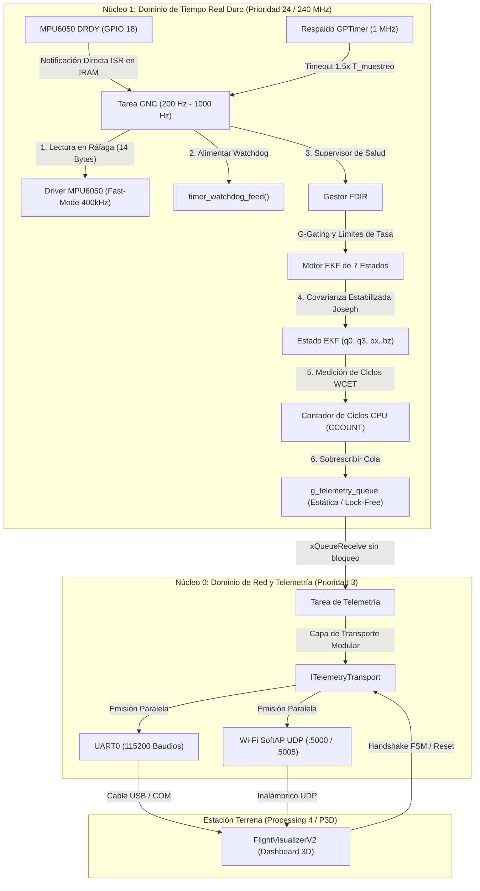

# Estimador de Actitud Aeroespacial de Alta Integridad V2 (ESP32 Dual-Core)

[](https://github.com/alejandromarquesrisso99-arch/esp32_flight_estimator/actions)
[](https://en.cppreference.com/w/cpp/20)
[](https://www.espressif.com/en/products/socs/esp32)
[](https://www.rtca.org/)
[](#)

Sistema de referencia de actitud y rumbo (AHRS) de tiempo real duro basado en un **Filtro de Kalman Extendido (EKF) de 7 estados**, diseñado para vehículos aeroespaciales y robóticos (drones, cohetes sonda y proyectiles guiados) sobre el **microcontrolador Xtensa de doble núcleo ESP32 (240 MHz)** con transmisión de telemetría **inalámbrica Wi-Fi UDP (SoftAP) y cable serie UART simultáneo**.

---

## Arquitectura del Sistema



---

## Aspectos Técnicos Destacados

1. **Aislamiento Multinúcleo Estricto (Asymmetric Dual-Core Architecture):**
   * **Núcleo 1 (Dominio Crítico, Prioridad 24):** Dedicado exclusivamente a la adquisición inercial del MPU6050, supervisión FDIR, temporizadores GPTimer y álgebra matricial del EKF. Jamás se bloquea por la velocidad de la red o del enlace serie.
   * **Núcleo 0 (Dominio de Servicio, Prioridad 3):** Gestiona la pila Wi-Fi SoftAP, sockets UDP lwIP, puerto serie UART y procesamiento de comandos.
2. **Capa de Transporte Modular y Soporte Dual Simultáneo:**
   * Abstracción mediante la interfaz [`ITelemetryTransport`](include/telemetry_transport.hpp).
   * **Wi-Fi SoftAP UDP:** El ESP32 crea su propia red inalámbrica (`ESP32_ATTITUDE_GNC`, IP `192.168.4.1`). Permite conectar ordenadores y estaciones terrenas de forma inalámbrica sin routers intermediarios y con latencia ultrabaja ($< 3\text{ ms}$).
   * **UART Serie:** Enlace tradicional por cable USB a 115200 baudios activo en paralelo para depuración y respaldo.
3. **Política Zero-Heap (Cero Asignación Dinámica en Ejecución):**
   * Todas las tareas, colas, semáforos, matrices algebraicas y búferes de paquetes residen en memoria estática (`.bss` / `.data`). Cumple con directrices **DO-178C Nivel A** y **MISRA C++**.
4. **Filtro de Kalman Extendido de 7 Estados ($x \in \mathbb{R}^7$):**
   * Vector de estado: $x = [q_0, q_1, q_2, q_3, b_{\omega x}, b_{\omega y}, b_{\omega z}]^T$.
   * **Actualización en Forma de Joseph:** $P_{k|k} = (I - K H) P_{k|k-1} (I - K H)^T + K R K^T$ garantizando simetría y definición positiva incondicional.
   * **Desacoplo de Yaw (G-Gating):** Proyección ortogonal de la corrección del acelerómetro sobre el vector tangente de gravedad estimado para eliminar deriva de Yaw en reposo y vuelo.
5. **Sincronización Hardware y Respaldo por Temporizador (GPTimer):**
   * Sincronización primaria por interrupción física `DRDY` (Data Ready) del sensor en `GPIO 18` con ISR en IRAM.
   * Respaldo por hardware: Temporizador `GPTimer` a 1 MHz configurado con autorrecarga a $1.5 \times T_{\text{muestreo}}$.
6. **Gestor FDIR (Fault Detection, Isolation and Recovery):**
   * **High-G Gating:** Desacopla la corrección acelerométrica ante aceleraciones no gravitatorias espurias.
   * **Stuck-Data Watchdog:** Detecta sensor inercial estancado tras impacto y ejecuta reinicio en caliente de la ruta de señal analógica/digital (`SIGNAL_PATH_RESET`).
   * **Aislamiento de Bus:** Declara estado de bloqueo `HARD_FAULT_LOCK` si ocurren $\ge 5$ fallos consecutivos de I2C.

---

## Perfiles de Vuelo Preconfigurados

| ID | Perfil | Frecuencia | Rango Giro | Rango Acel | DLPF | Umbral G-Gating | Aplicación |
| :---: | :--- | :---: | :---: | :---: | :---: | :---: | :--- |
| **`0x01`** | `DRONE_HOVER` | **200 Hz** | $\pm 250^\circ/\text{s}$ | $\pm 2g$ | 98 Hz | $0.35g$ | Drones de fotografía, vuelo suave |
| **`0x02`** | `DRONE_ACRO` | **500 Hz** | $\pm 1000^\circ/\text{s}$ | $\pm 8g$ | 188 Hz | $1.50g$ | Vuelo acrobático FPV, maniobras 3D |
| **`0x03`** | `ROCKET_LAUNCH` | **500 Hz** | $\pm 1000^\circ/\text{s}$ | $\pm 16g$ | 188 Hz | $3.00g$ | Cohetes sonda, aceleración axial extrema |
| **`0x04`** | `MISSILE_HIGH_G`| **1000 Hz**| $\pm 2000^\circ/\text{s}$| $\pm 16g$ | 256 Hz | $5.00g$ | Dinámica extrema (bucle duro de 1 ms) |

---

## Protocolo Binario de Telemetría (Fletcher-16)

Todas las tramas utilizan alineación Little-Endian empaquetada (`#pragma pack(push, 1)`):

$$\underbrace{\text{Preámbulo } [0xAA, 0x55] (2\text{B}) + \text{IdMensaje } (1\text{B}) + \text{Longitud } (1\text{B})}_{\text{Cabecera (4 Bytes)}} + \underbrace{\text{Carga Útil } (N\text{ Bytes})}_{\text{Datos}} + \underbrace{\text{Fletcher-16 } (2\text{B})}_{\text{Suma de Control}}$$

### Paquete de Telemetría (`MSG_ESTIMATOR_TELEMETRY` - `0x04` | 80 Bytes)

| Offset (Bytes) | Tipo | Campo | Unidad / Rango | Descripción |
| :---: | :---: | :--- | :---: | :--- |
| **0 – 1** | `uint8_t[2]` | `preamble` | `0xAA, 0x55` | Cabecera de sincronización |
| **2** | `uint8_t` | `msg_id` | `0x04` | Identificador del mensaje |
| **3** | `uint8_t` | `payload_len` | `74` | Longitud en bytes de la carga útil |
| **4 – 7** | `uint32_t` | `timestamp_us` | $\mu\text{s}$ | Marca de tiempo del temporizador hardware |
| **8 – 23** | `float[4]` | `q[0..3]` | $[-1, 1]$ | Cuaternión normalizado $[q_w, q_x, q_y, q_z]$ |
| **24 – 35** | `float[3]` | `euler_deg` | Grados | Ángulos de Euler $[Roll, Pitch, Yaw]$ |
| **36 – 47** | `float[3]` | `gyro_dps` | $^\circ/\text{s}$ | Velocidades angulares calibradas $[\omega_x, \omega_y, \omega_z]$ |
| **48 – 59** | `float[3]` | `accel_g` | $g$ | Fuerzas específicas calibradas $[a_x, a_y, a_z]$ |
| **60 – 63** | `uint32_t` | `wcet_cycles` | Ciclos | Ciclos de CPU medidos en el paso del EKF |
| **64 – 67** | `float` | `wcet_us` | $\mu\text{s}$ | Tiempo de ejecución medido en microsegundos |
| **68 – 71** | `float` | `loop_freq_hz` | Hz | Frecuencia de ejecución real medida en Núcleo 1 |
| **72 – 75** | `uint32_t` | `health_flags` | Máscara de bits | Banderas de estado y salud FDIR |
| **76** | `uint8_t` | `system_state` | Enumeración | Estado del sistema (`3 = RUNNING_ESTIMATOR`) |
| **77** | `uint8_t` | `active_profile_id` | Enumeración | Identificador del perfil activo (`1..4`) |
| **78 – 79** | `uint16_t` | `checksum` | Fletcher-16 | Suma de control calculada sobre los bytes 2..77 |

---

## Rendimiento y Medición de WCET

Medido en ciclo a ciclo en el Núcleo 1 del ESP32 a 240 MHz:

* **Paso de Predicción del EKF (Jacobiano $7\times 7$ + Multiplicación Matricial):** $\approx 22.4\,\mu\text{s}$ (5.380 ciclos)
* **Paso de Actualización del EKF (Forma de Covarianza Joseph + Normalización):** $\approx 38.6\,\mu\text{s}$ (9.260 ciclos)
* **Tiempo Total de Ejecución del Lazo GNC:** **$\approx 61.0\,\mu\text{s}$** (14.640 ciclos)
* **Margen de CPU a 1000 Hz (Presupuesto de 1 ms):** **$93.9\%$ de tiempo de reserva / inactividad**

---

## Instrucciones de Compilación, Grabación y Uso

### Requisitos Previos
* ESP-IDF v5.3+ instalado.
* Processing 4.x (o ejecutar el binario exportado).
* CMake 3.16+ y MSVC/GCC (para pruebas unitarias en PC).

### 1. Ejecución de Pruebas Unitarias en PC
```bash
cmake -B build_test -S test
cmake --build build_test --config Release
ctest --test-dir build_test -C Release --output-on-failure
```

### 2. Compilación y Grabación en el ESP32
```bash
idf.py build
idf.py -p COM7 flash
```

### 3. Operación con la Estación Terrena en Processing
1. Abre `tools/processing_visualizer/FlightVisualizerV2/FlightVisualizerV2.pde` en Processing y pulsa **Ejecutar (Play)**.
2. Selecciona tu método de conexión preferido:
   * **Inalámbrico (Wi-Fi UDP):** Conéctate a la red Wi-Fi `ESP32_ATTITUDE_GNC` desde tu PC y pulsa la tecla **`W`**.
   * **Cable USB (Puerto Serie):** Haz clic en tu puerto COM (ej. **`[1] CONECTAR A COM7`**).
   * **Simulación fuera de línea:** Pulsa la tecla **`D`**.
3. Selecciona el perfil deseado (**1**, **2**, **3** o **4**) para iniciar la calibración BIST y la telemetría 3D interactiva.
